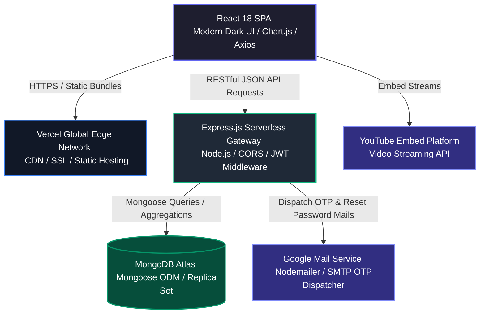
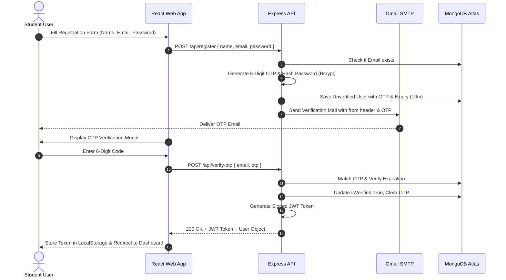
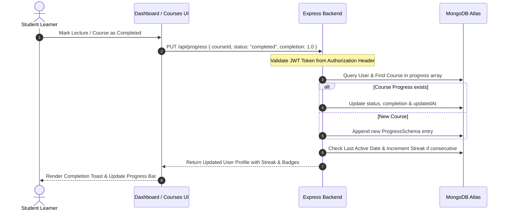

<!--
  SkillVoyage - Premium Repository Documentation
  Crafted to represent the definitive production documentation.
-->

# <p align="center"><br>SkillVoyage</p>

<p align="center">
  <strong>The Next-Generation AI-Powered Learning Experience & Career Navigator</strong><br>
  <em>Personalized learning journeys, peer benchmarking, gamified streaks, and real-time skill analytics.</em>
</p>

<p align="center">
  <a href="https://skillvoyageweb.vercel.app"></a>
  <a href="https://skillvoyage-backend.vercel.app"></a>
  <a href="https://github.com/mhjayeed715/skillvoyage/releases"></a>
  <a href="LICENSE"></a>
</p>

<p align="center">
  <a href="https://react.dev/"></a>
  <a href="https://nodejs.org/"></a>
  <a href="https://www.mongodb.com/"></a>
  <a href="https://jwt.io/"></a>
  <a href="https://vercel.com/"></a>
</p>

---

## 📖 Table of Contents
- [🌟 Project Overview](#-project-overview)
- [✨ Key Features & Core Modules](#-key-features--core-modules)
  - [1. Intelligent Authentication & Identity Lifecycle](#1-intelligent-authentication--identity-lifecycle)
  - [2. Interactive Learning Dashboard](#2-interactive-learning-dashboard)
  - [3. Curated Course Explorer & Video Player](#3-curated-course-explorer--video-player)
  - [4. Smart Note Vault & Tagged Annotations](#4-smart-note-vault--tagged-annotations)
  - [5. Gamification, Badges & Daily Streaks](#5-gamification-badges--daily-streaks)
  - [6. Learning Pace & Peer Comparison Analytics](#6-learning-pace--peer-comparison-analytics)
  - [7. Comprehensive Administrative Suite](#7-comprehensive-administrative-suite)
- [⚙️ System Architecture & Data Flows](#%EF%B8%8F-system-architecture--data-flows)
  - [High-Level Serverless Architecture](#high-level-serverless-architecture)
  - [Authentication & Verification Flow](#authentication--verification-flow)
  - [Course Progress & Streak Synchronization Flow](#course-progress--streak-synchronization-flow)
- [🗄️ Database Schema & Data Models](#%EF%B8%8F-database-schema--data-models)
- [📂 Code Structure & Modular Design](#-code-structure--modular-design)
- [🔌 API Reference & Endpoints](#-api-reference--endpoints)
- [🚀 Quick Start & Local Setup](#-quick-start--local-setup)
  - [Prerequisites](#prerequisites)
  - [1. Clone Repository](#1-clone-repository)
  - [2. Backend Setup](#2-backend-setup)
  - [3. Frontend Setup](#3-frontend-setup)
- [🌐 Deployment Guide (Vercel)](#-deployment-guide-vercel)
- [🤝 Contributing & Feedback](#-contributing--feedback)
- [📜 License](#-license)
- [👨💻 Author & Maintainer](#-author--maintainer)

---

## 🌟 Project Overview

**SkillVoyage** is a modern, full-stack educational operating system designed to elevate self-paced learning into a high-engagement, quantifiable journey. By combining curated course material, active note-taking with color-coded tagging, velocity tracking, peer benchmarking, and gamified reward mechanics, SkillVoyage prevents student burnout while boosting long-term knowledge retention.

Built with an ultra-sleek, accessible dark-mode aesthetic (Inter typography, glassmorphic cards, luminous indigo accents, and micro-interactions), SkillVoyage runs on a resilient serverless foundation optimized for instantaneous page loads and low-latency API interactions.

🌐 **Live Frontend**: [https://skillvoyageweb.vercel.app](https://skillvoyageweb.vercel.app)  
🔌 **Live Backend API**: [https://skillvoyage-backend.vercel.app](https://skillvoyage-backend.vercel.app)

---

## ✨ Key Features & Core Modules

### 1. Intelligent Authentication & Identity Lifecycle
- **6-Digit Email OTP Verification**: Automated transactional emails powered by Nodemailer and Gmail App Passwords to verify user authenticity upon registration.
- **Secure Password Reset**: One-click tokenized reset links sent to user inboxes with cryptographically hashed token expiration.
- **JWT Session Persistence**: Stateless authentication with automatic token renewal and route-level protection on both client and API boundaries.
- **Granular Role-Based Access Control**: Transparent separation between student learners (`user`) and instructors/platform operators (`admin`).

### 2. Interactive Learning Dashboard
- **Personalized Hero Metric Cards**: Instant high-level glance at active courses, total hours invested, current learning velocity, and active login streaks.
- **Weekly Progress Visualizer**: Interactive Chart.js graphs mapping study velocity against 7-day milestone targets.
- **Goal Setting & Checkpoints**: Custom personal goal creation with percentage progress indicators and deadline warnings.
- **Resume Learning Drawer**: Quick-jump launcher directly back into recently accessed video lectures.

### 3. Curated Course Explorer & Video Player
- **Category Filtering & Live Search**: Instant multi-category filtering across 30+ domains (Web Development, AI/ML, Cloud Computing, Cybersecurity, DevOps, UI/UX, and more).
- **Responsive Embed Studio**: YouTube integration with dynamic video embedding, thumbnail fallback caching, and active lecture navigation.
- **Course Status Lifecycle**: Seamless state machine transitions (`not-started` ➔ `in-progress` ➔ `completed`) with automated progress recalculation.

### 4. Smart Note Vault & Tagged Annotations
- **Color-Coded Digital Sticky Notes**: Organize lecture annotations with high-contrast note tints, multi-category taxonomy tags (`Important`, `Review`, `Concept`, `Formula`, `Project`), and custom color pickers.
- **Instant Search & Course Filter**: Real-time debounce query search across note titles, contents, and associated courses.
- **One-Click Export**: Download study notes directly to formatted markdown or plain text for offline review.

### 5. Gamification, Badges & Daily Streaks
- **Streak Multipliers**: Daily check-in trackers that reward continuous learning consistency with fire streak counters.
- **Milestone Badges**: Dynamic achievement unlock system recognizing first course completion, study streaks, and high-velocity study blocks.
- **Level Progression Engine**: Earn XP points for every lecture watched and milestone achieved.

### 6. Learning Pace & Peer Comparison Analytics
- **Velocity Tracker**: Calculates actual learning pace against cohort benchmarks to provide actionable pacing adjustments.
- **Peer Benchmark Matrix**: Anonymized percentile distribution comparing individual completion metrics against platform averages.

### 7. Comprehensive Administrative Suite
- **User Management Roster**: Inspect registered students, manage active permissions, track learning progress, and toggle administrative status.
- **Course Catalog Management**: Create, update, categorize, and archive courses with automated YouTube link parsing and verification.
- **Data Export Hub**: One-click CSV export utility generating audit-ready learning reports and user progress summaries.

---

## ⚙️ System Architecture & Data Flows

### High-Level Serverless Architecture



---

### Authentication & Verification Flow



---

### Course Progress & Streak Synchronization Flow



---

## 🗄️ Database Schema & Data Models

SkillVoyage uses MongoDB Atlas with strongly-typed Mongoose Schemas:

```
  ┌────────────────────────────────────────────────────────┐
  │                         User                           │
  ├────────────────────────────────────────────────────────┤
  │ _id                   : ObjectId (PK)                  │
  │ name                  : String (Required)              │
  │ email                 : String (Unique, Indexed)       │
  │ password              : String (Bcrypt Salted Hash)    │
  │ role                  : String (Enum: 'user', 'admin') │
  │ isVerified            : Boolean (Default: false)       │
  │ otp                   : String (Nullable)              │
  │ otpExpiry             : Date (Nullable)                │
  │ preferences           : Array<String>                  │
  │ avatar                : String (Base64 / URL)          │
  │ bio, phone            : String                         │
  │ linkedin, github, fb  : String                         │
  │ streak                : Number (Default: 0)            │
  │ badges                : Array<String>                  │
  │ goals                 : Array<String>                  │
  │ resetPasswordToken    : String (Nullable)              │
  │ resetPasswordExpires  : Date (Nullable)                │
  │ progress              : Array<ProgressSubdocument>     │
  │ createdAt, updatedAt  : Timestamps                     │
  └──────────────────────────┬─────────────────────────────┘
                             │
                             │ references courseId
                             ▼
  ┌────────────────────────────────────────────────────────┐
  │                        Course                          │
  ├────────────────────────────────────────────────────────┤
  │ _id                   : ObjectId (PK)                  │
  │ title                 : String (Required)              │
  │ youtube               : String (Video URL / Embed Link)│
  │ category              : String (Category Tag, Indexed) │
  │ createdAt, updatedAt  : Timestamps                     │
  └────────────────────────────────────────────────────────┘
```

---

## 📂 Code Structure & Modular Design

```
skillvoyage/
├── .gitignore                   # Standardized Git exclusion rules
├── README.md                    # Definitive project documentation
│
├── backend/                     # Node.js & Express REST API Server
│   ├── .env                     # Local environment configurations
│   ├── api/
│   │   └── index.js             # Main server gateway, CORS, and endpoint routes
│   ├── models/
│   │   ├── Course.js            # Mongoose Course entity schema
│   │   └── User.js              # Mongoose User entity & subdocument progress schema
│   ├── package.json             # Backend dependencies (express, mongoose, bcrypt, jwt)
│   └── vercel.json              # Serverless routing config for Vercel deployment
│
└── frontend/                    # React 18 Single Page Application
    ├── .env                     # Client API target configuration
    ├── package.json             # Frontend dependencies & build script (CI=false)
    ├── public/                  # Static assets (logo.png, favicon, manifest)
    └── src/
        ├── App.js               # Root routing, route guards, auth state handlers
        ├── App.css              # Global layout resets and responsive grid wrappers
        ├── index.js             # React DOM root hydration
        ├── index.css            # Design token system (colors, glassmorphism, animations)
        ├── components/          # Reusable UI component modules
        │   ├── CourseNotes.js   # Rich digital sticky note manager
        │   ├── CourseNotes.css  # Note styling with color picker tags
        │   ├── LearningPaceTracker.js  # Velocity and study duration calculator
        │   ├── Navbar.js        # Modern responsive dark navigation with role badge
        │   ├── Navbar.css       # Nav animations, glow states, and mobile drawer
        │   └── PeerComparison.js # Anonymized cohort benchmark visualizations
        └── pages/               # Top-level view controllers
            ├── AdminPanel.js    # Instructor hub for user and course management
            ├── AdminPanel.css   # Admin table layouts, modals, and export buttons
            ├── Courses.js       # Curated course explorer with live YouTube player
            ├── Courses.css      # Course cards, video preview modal, category chips
            ├── Dashboard.js     # Learner command center with Chart.js analytics
            ├── Dashboard.css    # Metrics grid, milestone checklists, streak display
            ├── Homepage.js      # High-conversion marketing landing page
            ├── Homepage.css     # Hero typography, feature showcase, dynamic CTAs
            ├── Profile.js       # Student portfolio, social links, preferences editor
            ├── Profile.css      # Avatar uploader, profile statistics cards
            ├── ResetPassword.js # Token-validated password reset form
            ├── ResetPassword.css# Auth flow visual cards
            ├── Settings.js      # User preferences, notifications, danger zone
            └── Settings.css     # Settings panels, toggles, account management
```

---

## 🔌 API Reference & Endpoints

### Authentication & Account
| Method | Endpoint | Access | Description |
| :--- | :--- | :--- | :--- |
| `POST` | `/api/register` | Public | Register new student and send 6-digit OTP email |
| `POST` | `/api/verify-otp` | Public | Verify OTP code and issue JWT bearer token |
| `POST` | `/api/login` | Public | Authenticate user credentials and return session token |
| `POST` | `/api/forgot-password` | Public | Send password reset token link to student email |
| `POST` | `/api/reset-password` | Public | Validate reset token and update account password |

### User Profile & Progress
| Method | Endpoint | Access | Description |
| :--- | :--- | :--- | :--- |
| `GET` | `/api/user` | Authenticated | Retrieve logged-in student profile, streak, & stats |
| `PUT` | `/api/profile` | Authenticated | Update bio, avatar, phone, preferences, & social links |
| `PUT` | `/api/progress` | Authenticated | Update course status (`not-started`, `in-progress`, `completed`) |
| `PUT` | `/api/goals` | Authenticated | Update personalized weekly study goals |

### Courses & Catalog
| Method | Endpoint | Access | Description |
| :--- | :--- | :--- | :--- |
| `GET` | `/api/courses` | Public | Fetch complete course catalog with optional search & filter |
| `POST` | `/api/courses` | Admin | Create a new course entry with verified YouTube embed |
| `PUT` | `/api/courses/:id` | Admin | Update course metadata, category, or video URL |
| `DELETE`| `/api/courses/:id` | Admin | Permanently delete course entry |

### Administration
| Method | Endpoint | Access | Description |
| :--- | :--- | :--- | :--- |
| `GET` | `/api/admin/users` | Admin | Retrieve all registered users with detailed progress |
| `PUT` | `/api/admin/users/:id/role`| Admin | Promote or demote user permissions (`user` / `admin`) |
| `DELETE`| `/api/admin/users/:id` | Admin | Delete a user account |

---

## 🚀 Quick Start & Local Setup

### Prerequisites
- [Node.js (v18.x or v20.x)](https://nodejs.org/en)
- [npm](https://www.npmjs.com/) (v9+)
- [MongoDB Atlas Cluster](https://www.mongodb.com/cloud/atlas) or Local MongoDB Instance
- [Git](https://git-scm.com/)

---

### 1. Clone Repository
```bash
git clone https://github.com/mhjayeed715/skillvoyage.git
cd skillvoyage
```

---

### 2. Backend Setup
1. Navigate to the backend directory:
   ```bash
   cd backend
   npm install
   ```
2. Create or verify `backend/.env`:
   ```env
   PORT=5000
   MONGO_URI=mongodb+srv://<username>:<password>@cluster.mongodb.net/skillvoyage?retryWrites=true&w=majority
   JWT_SECRET=your_super_secret_jwt_key
   EMAIL_USER=your_email@gmail.com
   EMAIL_PASS=your_gmail_16_digit_app_password
   FRONTEND_URL=http://localhost:3000
   ```
3. Start the backend development server:
   ```bash
   npm run dev   # or: node api/index.js
   ```
   *Backend will run on [http://localhost:5000](http://localhost:5000).*

---

### 3. Frontend Setup
1. Open a new terminal and navigate to the frontend directory:
   ```bash
   cd frontend
   npm install
   ```
2. Create or verify `frontend/.env`:
   ```env
   REACT_APP_BACKEND_URL=http://localhost:5000
   ```
3. Start the React development server:
   ```bash
   npm start
   ```
   *Frontend will launch on [http://localhost:3000](http://localhost:3000).*

---

## 🌐 Deployment Guide (Vercel)

SkillVoyage is optimized for single-command deployment on Vercel:

### 1. Deploy Backend API
1. Import repository to Vercel and set Root Directory to `backend`.
2. Add Environment Variables in **Vercel Settings → Environment Variables**:
   - `MONGO_URI`
   - `JWT_SECRET`
   - `EMAIL_USER`
   - `EMAIL_PASS`
   - `FRONTEND_URL` (`https://skillvoyageweb.vercel.app`)
3. Deploy. Note your backend URL (`https://skillvoyage-backend.vercel.app`).

### 2. Deploy Frontend SPA
1. Import repository to Vercel and set Root Directory to `frontend`.
2. Add Environment Variables:
   - `REACT_APP_BACKEND_URL` (`https://skillvoyage-backend.vercel.app`)
3. Build command is pre-configured with `CI=false` to ensure clean production compilation.
4. Deploy.

---

## 🤝 Contributing & Feedback

Contributions, feature requests, and bug reports are warmly welcomed!  
Feel free to open an issue or submit a pull request on the [GitHub Repository](https://github.com/mhjayeed715/skillvoyage).

1. **Fork** the Repository
2. **Create** your Feature Branch (`git checkout -b feature/NewFeature`)
3. **Commit** your Changes (`git commit -m 'feat: add NewFeature'`)
4. **Push** to the Branch (`git push origin feature/NewFeature`)
5. **Open** a Pull Request

---

## 📜 License

Distributed under the **MIT License**. See [`LICENSE`](LICENSE) for details.

```text
MIT License
Copyright (c) 2026 S. M. Mehrab Hossain Jayeed
```

---

## 👨💻 Author & Maintainer

**S. M. Mehrab Hossain Jayeed**  
🎓 *Crafted with passion for accessible, gamified, and outcome-driven learning.*

- 🔗 **GitHub Profile**: [@mhjayeed715](https://github.com/mhjayeed715)
- 📌 **Repository**: [https://github.com/mhjayeed715/skillvoyage](https://github.com/mhjayeed715/skillvoyage)
- 🌐 **Live Web Application**: [https://skillvoyageweb.vercel.app](https://skillvoyageweb.vercel.app)
- 🔌 **API Endpoint**: [https://skillvoyage-backend.vercel.app](https://skillvoyage-backend.vercel.app)

---

<p align="center">
  <sub style="color: #6366f1;">SkillVoyage — Empowering Continuous Growth & Knowledge Discovery.</sub>
</p>
